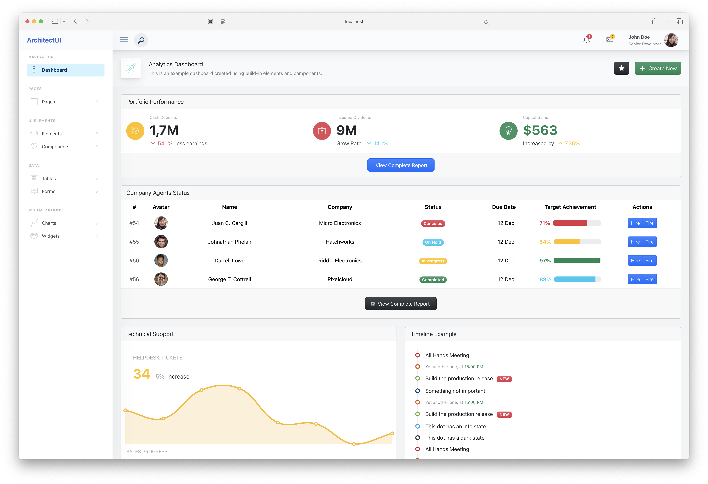

# ArchitectUI Angular - Free Admin Dashboard Template

**A modern, responsive admin dashboard template built with Angular 20, Bootstrap 5, and Chart.js**

ArchitectUI Angular is a professional admin dashboard template perfect for building modern web applications, SaaS platforms, and administrative interfaces. This free version provides a solid foundation with essential components and features to get your project started quickly.

## Features

- **Modern Angular 20.1.4** - Built with the latest Angular framework
- **Bootstrap 5.3.7** - Responsive design with modern Bootstrap components
- **Interactive Charts** - Powered by Chart.js v4 with ng2-charts integration
- **NgRx State Management** - Centralized state management for scalable applications
- **TypeScript 5.8.3** - Type-safe development experience
- **ESLint Integration** - Modern code linting and quality assurance
- **Mobile Responsive** - Optimized for all device sizes
- **Clean Code Architecture** - Well-structured, maintainable codebase

## What's Included

- **Dashboard Analytics** - Interactive dashboard with charts and widgets
- **UI Elements** - Buttons, cards, dropdowns, icons, timeline, and more
- **Components** - Tabs, accordions, modals, pagination, progress bars, tooltips
- **Form Elements** - Complete form controls and layouts
- **Data Tables** - Responsive table components
- **Charts** - Line, bar, pie, doughnut, radar, polar area, and more chart types
- **User Pages** - Login, register, and password recovery pages
- **Responsive Layout** - Header, sidebar, footer layout system

## Live Demo

Check out the live demo: **[ArchitectUI Angular Free Demo](https://demo.dashboardpack.com/architectui-angular-free/)**

## Preview



## Quick Start

### Prerequisites

- Node.js (version 18 or higher)
- npm or yarn
- Angular CLI

### Installation

1. Clone the repository:
```bash
git clone https://github.com/your-username/architectui-angular-free.git
cd architectui-angular-free
```

2. Install dependencies:
```bash
npm install
```

3. Start the development server:
```bash
ng serve
```

4. Open your browser and navigate to `http://localhost:4200`

### Build for Production

```bash
ng build --prod
```

The build artifacts will be stored in the `dist/` directory.

## Development Commands

| Command | Description |
|---------|-------------|
| `ng serve` | Start development server at http://localhost:4200 |
| `ng build` | Build the project for production |
| `npm run build:prod` | Build for subdirectory deployment with correct base href |
| `ng test` | Run unit tests via Karma |
| `ng lint` | Run ESLint code analysis |
| `ng generate component <name>` | Generate a new component |

## Production Deployment

### For Subdirectory Deployment
When deploying to a subdirectory like `https://demo.dashboardpack.com/architectui-angular-free/`:

```bash
npm run build:prod
```

This command:
- Builds with production optimizations
- Sets base href to `/architectui-angular-free/`
- Outputs to `dist/architectui-angular-free/`

Then upload the contents of `dist/architectui-angular-free/` to your server's subdirectory.

### For Root Domain Deployment
When deploying to a root domain like `https://yourdomain.com/`:

```bash
ng build --configuration production
```

### Server Configuration

#### Apache (.htaccess)
An `.htaccess` file is included in the project root. Copy it to your deployment folder along with the built files.

#### Nginx
Add this to your server configuration:
```nginx
location /architectui-angular-free/ {
    try_files $uri $uri/ /architectui-angular-free/index.html;
}
```

### Important Deployment Notes

1. **After building with `npm run build:prod`:**
   - Upload all contents from `dist/architectui-angular-free/browser/`
   - The `.htaccess` file is automatically included in the build
   - Verify the base href in index.html is `/architectui-angular-free/`

2. **File Structure on Server:**
   ```
   /architectui-angular-free/
   ├── index.html (with correct base href)
   ├── favicon.ico
   ├── .htaccess (handles direct URL access)
   ├── main-*.js
   ├── polyfills-*.js
   ├── scripts-*.js
   ├── styles-*.css
   ├── assets/
   └── media/
   ```

3. **Direct URL Access Fix:**
   The `.htaccess` file ensures that direct links like `/architectui-angular-free/dashboards/analytics` work correctly by redirecting all routes to `index.html`, allowing Angular to handle the routing.

## Project Structure

```
src/
├── app/
│   ├── DemoPages/           # Main application pages
│   │   ├── Dashboards/      # Dashboard components
│   │   ├── Elements/        # UI elements
│   │   ├── Components/      # Interactive components
│   │   ├── Forms/          # Form components
│   │   ├── Tables/         # Table components
│   │   ├── Charts/         # Chart components
│   │   └── UserPages/      # Authentication pages
│   ├── Layout/             # Layout components (header, sidebar, footer)
│   ├── ThemeOptions/       # Theme configuration and state management
│   └── shared/             # Shared modules and components
├── assets/                 # Static assets (images, styles, etc.)
└── environments/          # Environment configurations
```

## Browser Support

- **Chrome** (latest)
- **Firefox** (latest)
- **Safari** (latest)
- **Edge** (latest)

## Resources & Related Templates

### More Admin Dashboards
Explore more premium admin dashboard templates at [Colorlib](https://colorlib.com):
- [Angular Admin Templates](https://colorlib.com/wp/angular-admin-templates/) - Collection of the best Angular admin dashboards
- [Bootstrap Admin Templates](https://colorlib.com/wp/bootstrap-admin-templates/) - Premium Bootstrap-based admin templates
- [Free Admin Templates](https://colorlib.com/wp/free-admin-templates/) - High-quality free admin dashboard templates

### Professional Versions
- **ArchitectUI Angular Pro** - [Get the Pro Version](https://dashboardpack.com/theme-details/architectui-angular-7-bootstrap-material-design-pro) - Premium version with advanced components, more pages, and premium support
- **React Version** - [ArchitectUI React](https://dashboardpack.com/theme-details/architectui-dashboard-react-pro)
- **Vue Version** - [ArchitectUI Vue](https://dashboardpack.com/theme-details/architectui-dashboard-vue-pro)
- **HTML/jQuery Version** - [ArchitectUI HTML](https://dashboardpack.com/theme-details/architectui-dashboard-html-pro/)

### DashboardPack
Visit [DashboardPack.com](https://dashboardpack.com) for more premium admin dashboard templates and themes for various frameworks and technologies.

## Changelog

See [CHANGELOG.md](CHANGELOG.md) for a detailed history of changes and updates.

## License

This project is licensed under the MIT License - see the [LICENSE](LICENSE) file for details.

## Support

For questions and support:
- Check the [issues page](../../issues) for common problems and solutions
- Visit [DashboardPack](https://dashboardpack.com) for premium support options
- Browse [Colorlib's admin templates](https://colorlib.com/wp/angular-admin-templates/) for more resources

---

Made with care by the DashboardPack team. Built on the foundation of Angular, Bootstrap, and modern web technologies.